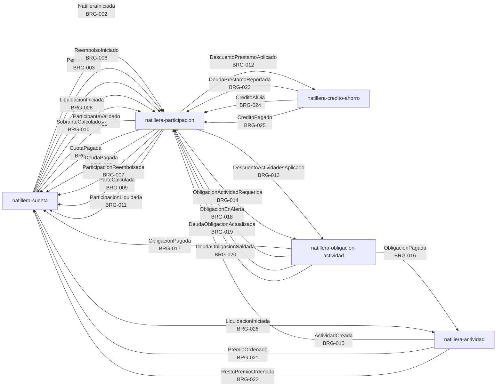

# Topología — ecosistema

> Generado por FndValidator desde ecosystem-topology.json — NO editar a mano.
> Regenerar con: `FndValidator diagram <dir-sesión>`

```mermaid
graph LR
  natillera_cuenta["natillera-cuenta"]
  natillera_participacion["natillera-participacion"]
  natillera_credito_ahorro["natillera-credito-ahorro"]
  natillera_obligacion_actividad["natillera-obligacion-actividad"]
  natillera_actividad["natillera-actividad"]
  natillera_participacion -->|"ParticipanteValidado<br/>BRG-001"| natillera_cuenta
  natillera_cuenta -->|"NatilleraIniciada<br/>BRG-002"| natillera_participacion
  natillera_cuenta -->|"PeriodoAbierto<br/>BRG-003"| natillera_participacion
  natillera_participacion -->|"CuotaPagada<br/>BRG-004"| natillera_cuenta
  natillera_participacion -->|"DeudaPagada<br/>BRG-005"| natillera_cuenta
  natillera_cuenta -->|"ReembolsoIniciado<br/>BRG-006"| natillera_participacion
  natillera_participacion -->|"ParticipacionReembolsada<br/>BRG-007"| natillera_cuenta
  natillera_cuenta -->|"LiquidacionIniciada<br/>BRG-008"| natillera_participacion
  natillera_participacion -->|"ParteCalculada<br/>BRG-009"| natillera_cuenta
  natillera_cuenta -->|"SobranteCalculado<br/>BRG-010"| natillera_participacion
  natillera_participacion -->|"ParticipacionLiquidada<br/>BRG-011"| natillera_cuenta
  natillera_participacion -->|"DescuentoPrestamoAplicado<br/>BRG-012"| natillera_credito_ahorro
  natillera_participacion -->|"DescuentoActividadesAplicado<br/>BRG-013"| natillera_obligacion_actividad
  natillera_participacion -->|"ObligacionActividadRequerida<br/>BRG-014"| natillera_obligacion_actividad
  natillera_actividad -->|"ActividadCreada<br/>BRG-015"| natillera_participacion
  natillera_obligacion_actividad -->|"ObligacionPagada<br/>BRG-016"| natillera_actividad
  natillera_obligacion_actividad -->|"ObligacionPagada<br/>BRG-017"| natillera_cuenta
  natillera_obligacion_actividad -->|"ObligacionEnAlerta<br/>BRG-018"| natillera_participacion
  natillera_obligacion_actividad -->|"DeudaObligacionActualizada<br/>BRG-019"| natillera_participacion
  natillera_obligacion_actividad -->|"DeudaObligacionSaldada<br/>BRG-020"| natillera_participacion
  natillera_actividad -->|"PremioOrdenado<br/>BRG-021"| natillera_cuenta
  natillera_actividad -->|"RestoPremioOrdenado<br/>BRG-022"| natillera_cuenta
  natillera_credito_ahorro -->|"DeudaPrestamoReportada<br/>BRG-023"| natillera_participacion
  natillera_credito_ahorro -->|"CreditoAlDia<br/>BRG-024"| natillera_participacion
  natillera_credito_ahorro -->|"CreditoPagado<br/>BRG-025"| natillera_participacion
  natillera_cuenta -->|"LiquidacionIniciada<br/>BRG-026"| natillera_actividad
```
